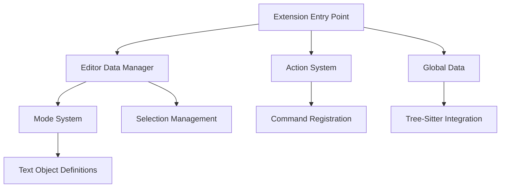

# Architectural Overview

OOMotion is a text object-oriented VSCode extension that provides a unique approach to text editing inspired by Vim, Kakoune, and Helix editors. It introduces a modal editing paradigm focused on text objects rather than just cursor positions.

## High-Level Architecture

The extension follows a modular architecture pattern with clear separation of concerns:

The architecture is centered around a few key concepts:
1. **Text Objects**: The fundamental unit of interaction
2. **Modes**: Different ways to select and navigate text objects
3. **States**: Similar to Vim modes (NORMAL, INSERT, SELECT)
4. **Actions**: Commands that operate on the current selection/mode

## Architectural Recommendations

1. **Module Refactoring**
   - Consider splitting the large mode implementation files into smaller, more focused modules
   - Implement a more formal dependency injection pattern to improve testability

2. **Type Safety Improvements**
   - Replace some of the type assertions with proper runtime checks
   - Add more interfaces to formalize the contracts between components

3. **Performance Optimization**
   - Implement caching mechanisms for frequently accessed Tree-sitter nodes
   - Optimize the selection highlight rendering for large files
