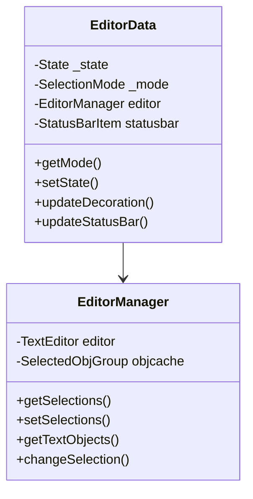
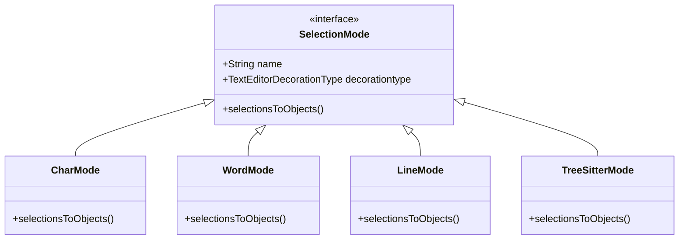
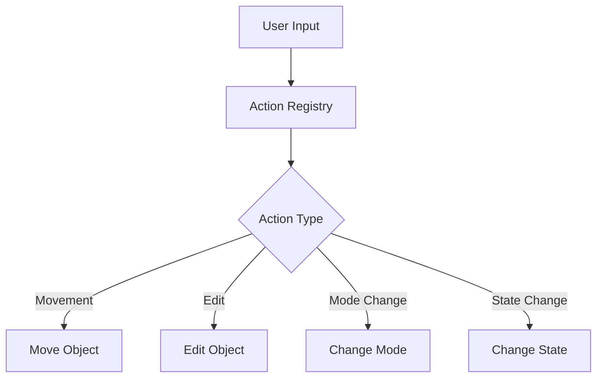
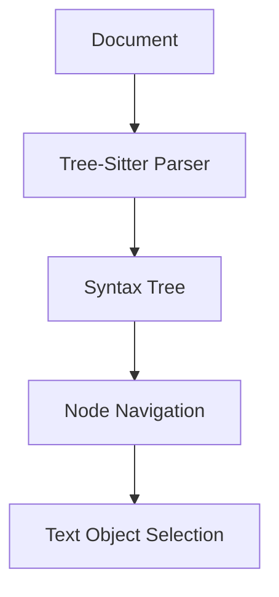

# Core Components

## 1. EditorData and EditorManager

The `EditorData` class is the central component that maintains the state of each editor, including:
- The current editing state (NORMAL, INSERT, SELECT)
- The active selection mode
- References to VSCode's editor interface

The `EditorDataManager` maintains a mapping of editor instances to their corresponding `EditorData` objects.

## 2. Mode System

The mode system defines different ways to select and navigate text objects:

Each mode implements the `SelectionMode` interface and provides its own way to convert VSCode selections to text objects.

## 3. Action System

The action system processes user input and maps it to operations on the selected text objects:

Actions are registered centrally in `actionList.ts` and are grouped by functionality (movement, find, insert, undo, etc.).

## 4. Tree-Sitter Integration

OOMotion leverages Tree-sitter for syntax-aware text manipulation through its TreeSitterMode:

Tree-sitter provides syntax trees that allow the extension to select semantically meaningful units of code.
