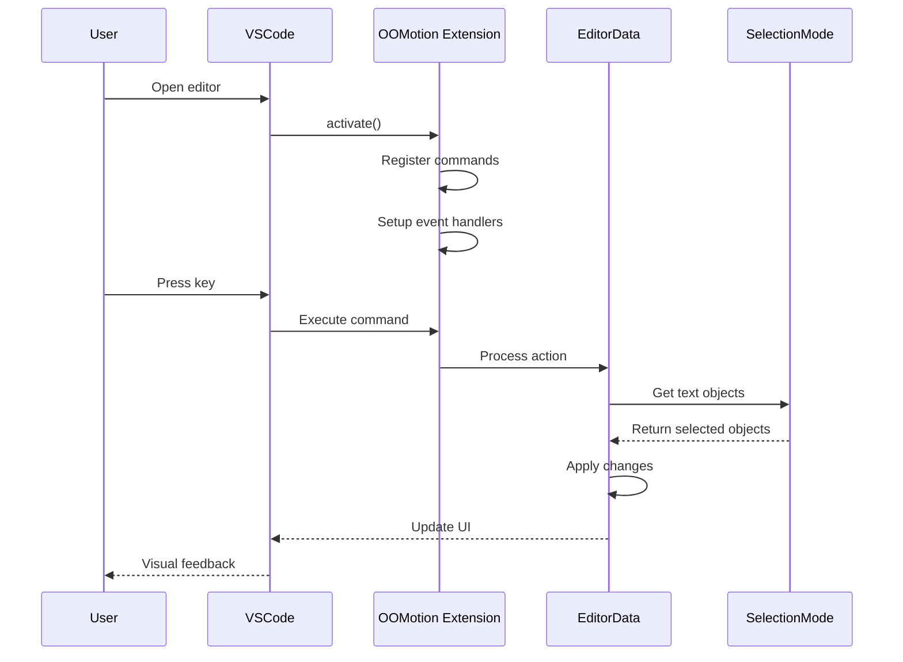
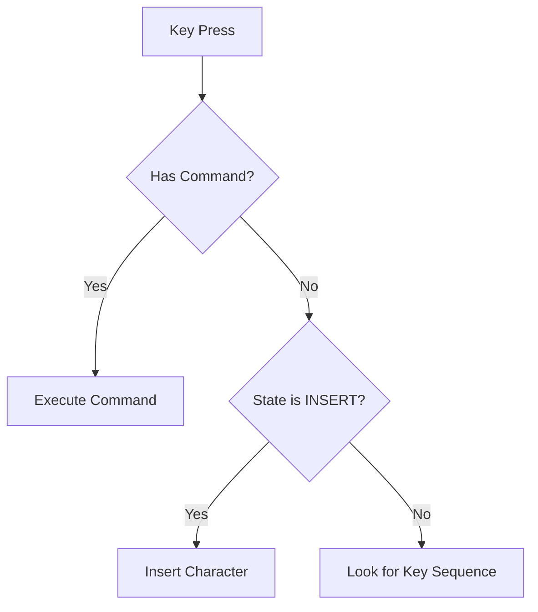

# Extension Workflow

The OOMotion extension follows a specific workflow from activation to user interaction:

## Activation Flow

1. When VSCode starts, the `activate()` function in `extension.ts` runs
2. Commands are registered via the `registerAction()` function
3. Event handlers are set up for editor changes, selection changes, and document edits
4. The extension initializes with the editor in NORMAL mode

## Command Execution Flow

1. User presses a key mapped to an OOMotion command
2. VSCode calls the registered command handler
3. The handler retrieves the EditorData for the active editor
4. The appropriate action is executed based on the current state and mode
5. Selection and decorations are updated to provide visual feedback

## Key Event Processing

