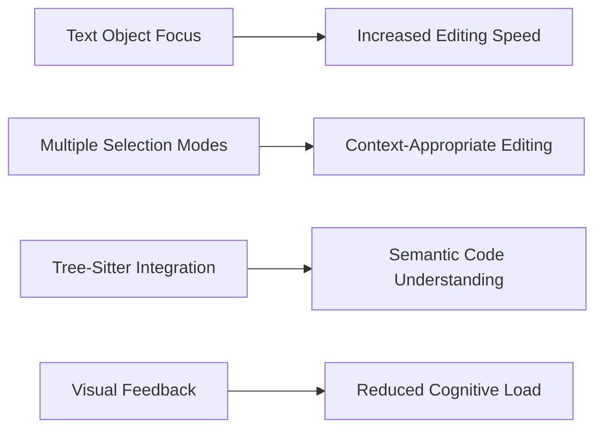
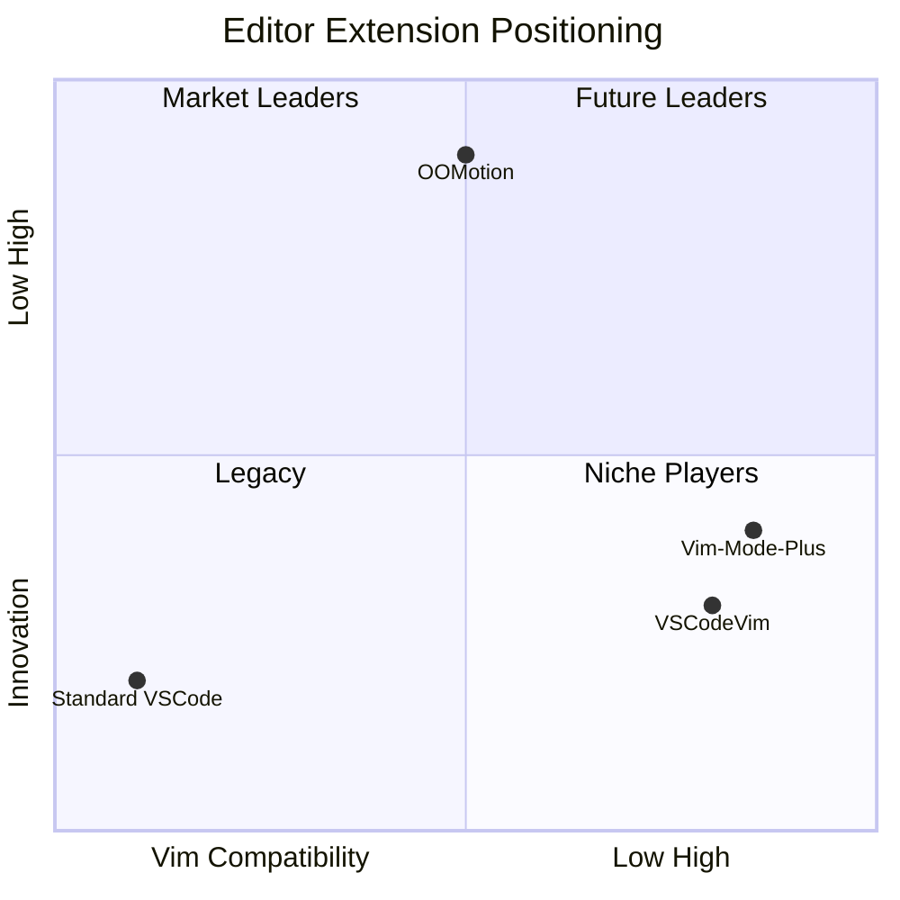
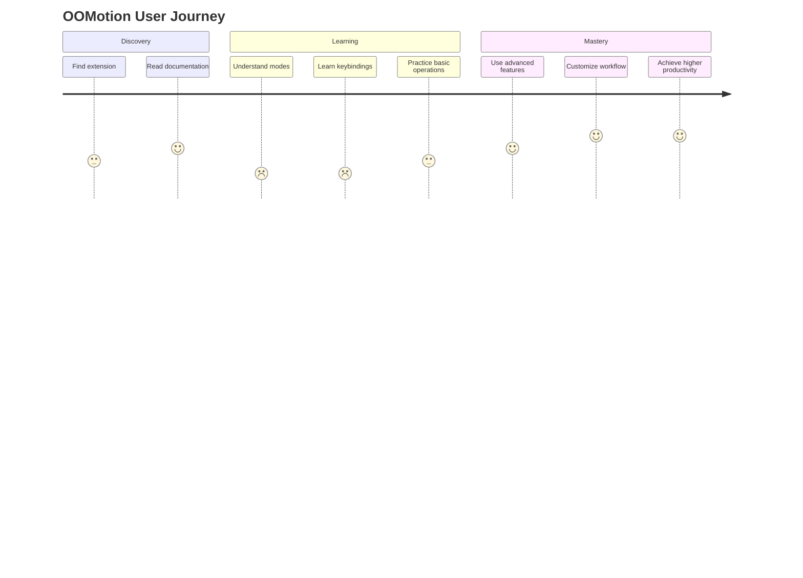
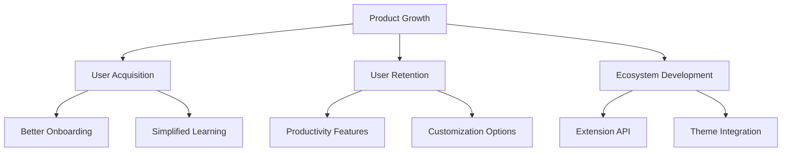

# Product Analysis

From a product management perspective, OOMotion represents an innovative approach to editing in VSCode with several notable characteristics:

## Target Audience

OOMotion targets developers who:

1. Are experienced with modal editors like Vim, Kakoune, or Helix
2. Want more efficient text manipulation capabilities in VSCode
3. Prefer keyboard-driven workflows
4. Value semantic understanding of code over character-by-character editing

## Unique Value Proposition

OOMotion's core value proposition is the combination of:

1. **Text object-oriented editing**: Focusing on semantically meaningful units of text
2. **Multiple selection modes**: Allowing different granularities of selection
3. **Tree-sitter integration**: Providing language-aware code manipulation
4. **Visual feedback**: Clear indication of current mode and selection

## Competitive Analysis

When compared to other VSCode modal editing extensions:

| Feature | OOMotion | VSCodeVim | Vim-Mode-Plus |
|---------|----------|-----------|---------------|
| Text object focus | ✓ | Partial | Partial |
| Multiple selection modes | ✓ | ✗ | ✗ |
| Tree-sitter integration | ✓ | ✗ | ✗ |
| Visual feedback | Strong | Limited | Limited |
| Learning curve | Medium | High | High |
| Vim compatibility | Partial | High | High |

## Market Position

OOMotion occupies a unique position in the editor extension market:

OOMotion trades some Vim compatibility for innovation in the text-object approach, positioning it as a forward-looking alternative rather than a direct Vim replacement.

## User Experience Analysis

The user experience of OOMotion can be broken down into several key components:

1. **Discoverability**: The extension relies primarily on documentation for discoverability, with limited in-editor guidance
2. **Learnability**: The learning curve is moderately steep, particularly for users unfamiliar with modal editing
3. **Efficiency**: Once mastered, the approach enables high-efficiency editing
4. **Visual feedback**: The extension provides strong visual cues through selection highlighting and cursor styles

## Product Recommendations

1. **Onboarding Improvements**
   - Add an interactive tutorial for new users
   - Create a "cheat sheet" command showing available commands in the current context
   - Implement a status bar tooltip explaining the current mode

2. **Feature Enhancements**
   - Add user-configurable modes for custom text object definitions
   - Implement a command palette with visual previews of operations
   - Create mode-specific settings for fine-tuning behavior

3. **Extension Ecosystem**
   - Design an API allowing other extensions to register custom text objects
   - Create themes specifically designed for OOMotion's visual feedback system
   - Develop snippet integration tailored to the text object model

