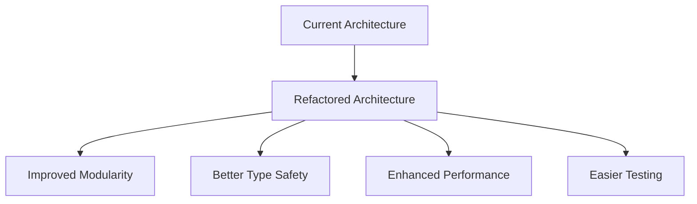
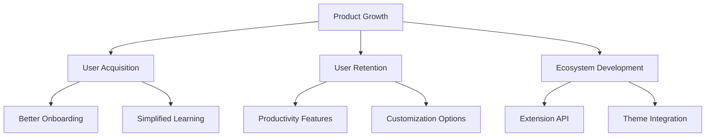

# Recommendations

This document was originally AI generated, and consolidates all recommendations across architectural, development, and product perspectives for the OOMotion VSCode extension.

## Architectural Recommendations

1. **Module Refactoring**
   - Consider splitting the large mode implementation files into smaller, more focused modules
   - Implement a more formal dependency injection pattern to improve testability

2. **Type Safety Improvements**
   - Replace some of the type assertions with proper runtime checks
   - Add more interfaces to formalize the contracts between components

3. **Performance Optimization**
   - Implement caching mechanisms for frequently accessed Tree-sitter nodes
   - Optimize the selection highlight rendering for large files

## Development Recommendations

1. **Testing Infrastructure**
   - Add unit tests for core components, particularly the text object manipulation logic
   - Implement integration tests for mode transitions and commands

2. **Documentation Improvements**
   - Add JSDoc comments to key interfaces and classes
   - Create architectural documentation explaining the component relationships

3. **Code Quality**
   - Standardize error handling across the codebase
   - Reduce duplication in similar mode implementations
   - Implement a consistent logging strategy

## Product Recommendations

1. **Onboarding Improvements**
   - Add an interactive tutorial for new users
   - Create a "cheat sheet" command showing available commands in the current context
   - Implement a status bar tooltip explaining the current mode

2. **Feature Enhancements**
   - Add user-configurable modes for custom text object definitions
   - Implement a command palette with visual previews of operations
   - Create mode-specific settings for fine-tuning behavior

3. **Extension Ecosystem**
   - Design an API allowing other extensions to register custom text objects
   - Create themes specifically designed for OOMotion's visual feedback system
   - Develop snippet integration tailored to the text object model

## Marketing and Community Recommendations

1. **Community Building**
   - Create a dedicated forum or Discord channel for users
   - Encourage sharing of custom configurations and workflows
   - Highlight user success stories and productivity gains

2. **Educational Content**
   - Publish tutorials explaining the text object philosophy
   - Create screencasts demonstrating efficient editing patterns
   - Compare with traditional Vim workflows to help transitioning users

3. **Metrics and Feedback**
   - Implement anonymous usage tracking with user consent
   - Create a feedback mechanism within the extension
   - Track key metrics like daily active users and retention
